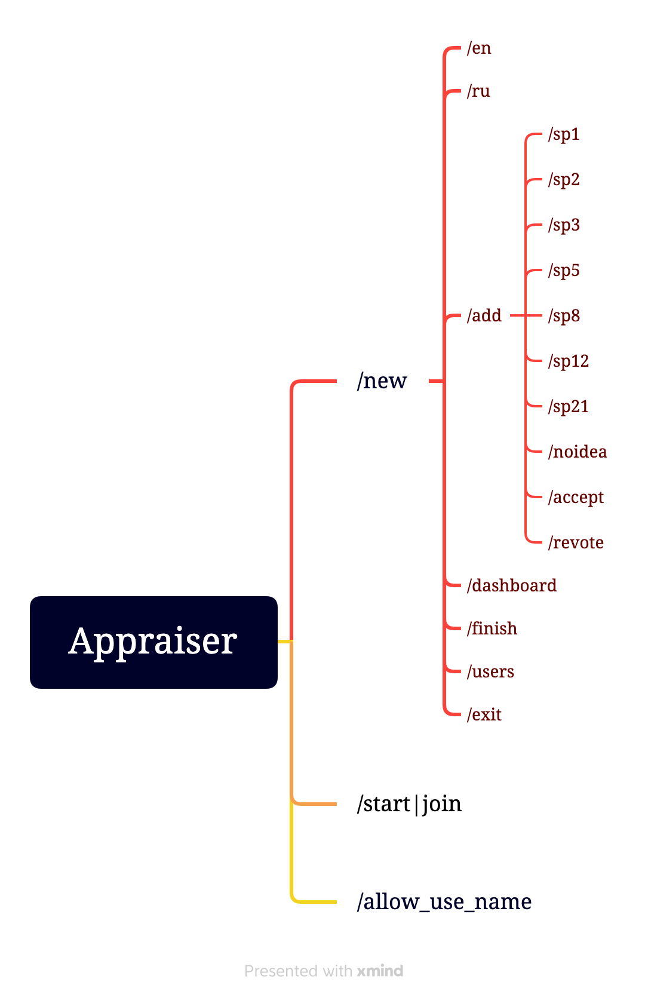

# Inc.TeamAssistant.Appraiser

Inc.TeamAssistant.Appraiser - бот для оценки задач через планинг покер

https://team-assistant.online/ - отображение состояния текущих сессий оценки

## Telegram bots

Production - inc_teamassistant_appraiser_bot


Development - inc_teamassistant_test_bot


Список управляющих команд (доступны только модератору сессии):
- `/new` создает новую сессию оценки  (при помощи функции reply ввести название сессии)
- `/allow_use_name` разрешить использовать имя из телеграм
- `/en` переключить язык на английский
- `/ru` переключить язык на русский
- `/dashboard` предоставляет url-адрес для доступа к карточке задачи
- `/add` добавляет задачу для оценки (при помощи функции reply ввести название задачи)
- `/revote` перезапустить оценку задачи
- `/accept` принять оценку для истории
- `/finish` завершить сессию оценки
- `/help` отобразить список управляющих команд

Список команд для оценки:
- `/start|join` подключение к сессии оценки
- `/sp1` оценить задачу в 1SP
- `/sp2` оценить задачу в 2SP
- `/sp3` оценить задачу в 3SP
- `/sp5` оценить задачу в 5SP
- `/sp8` оценить задачу в 8SP
- `/sp13` оценить задачу в 13SP
- `/sp21` оценить задачу в 21SP
- `/users` отобразить список подключенных пользователей
- `/exit` отключение от сессии оценки
- `/noidea` нет идей о сложности задачи



## Развертывание

В данном разделе кратко опишу процесс развертывания бекенда для бота

### Сборка образа

Для сборки образа склонируйте репозиторий, перейдите в корень директории с проектом и собоать образы: Application, Migrations.

Application

```
dotnet publish src/Inc.TeamAssistant.Appraiser.Backend --configuration Release --framework net6.0 --runtime linux-x64 --self-contained true --output output/Inc.TeamAssistant.Appraiser.Backend
docker build --build-arg PROJECT=Inc.TeamAssistant.Appraiser.Backend -t inc.teamassistant.appraiser:1.3.3 -f cicd/dockerfile.app_component .
docker tag inc.teamassistant.appraiser:1.3.3 dyatlovhome/inc.teamassistant.appraiser:1.3.3
docker push dyatlovhome/inc.teamassistant.appraiser:1.3.3
```

Migrations

```
dotnet publish src/Inc.TeamAssistant.Appraiser.MigrationsRunner --configuration Release --framework net6.0 --runtime linux-x64 --self-contained true --output output/Inc.TeamAssistant.Appraiser.MigrationsRunner
docker build --build-arg PROJECT=Inc.TeamAssistant.Appraiser.MigrationsRunner -t inc.teamassistant.appraiser.migrationsrunner:1.3.3 -f cicd/dockerfile.migrations_runner .
docker tag inc.teamassistant.appraiser.migrationsrunner:1.3.3 dyatlovhome/inc.teamassistant.appraiser.migrationsrunner:1.3.3
docker push dyatlovhome/inc.teamassistant.appraiser.migrationsrunner:1.3.3
```

### Запуск

Для запуска бекенда необходимо:
- создать телеграмм бота https://t.me/botfather
- указать токен от созданного бота в `cicd/docker-compose.yml`
- сконфигурировать nginx `cicd/nginx.conf`
- выпустить `ssl` сертификаты или удалить использование `https` из `nginx.conf` и `docker-compose.yml`

```
docker-compose up -d
```