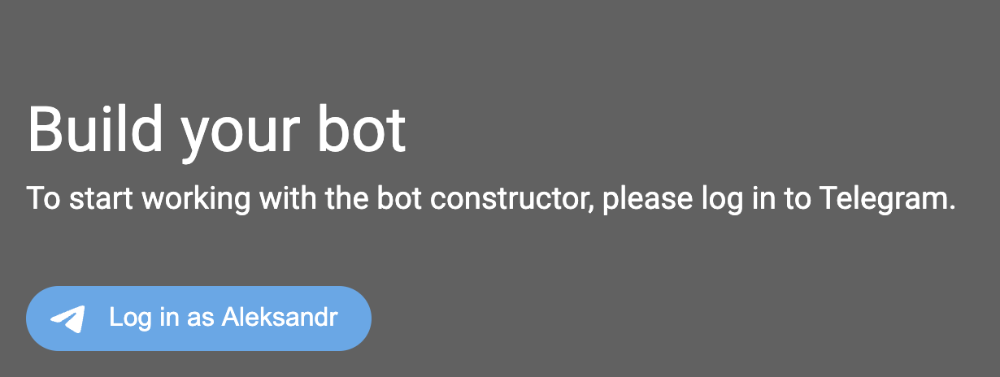
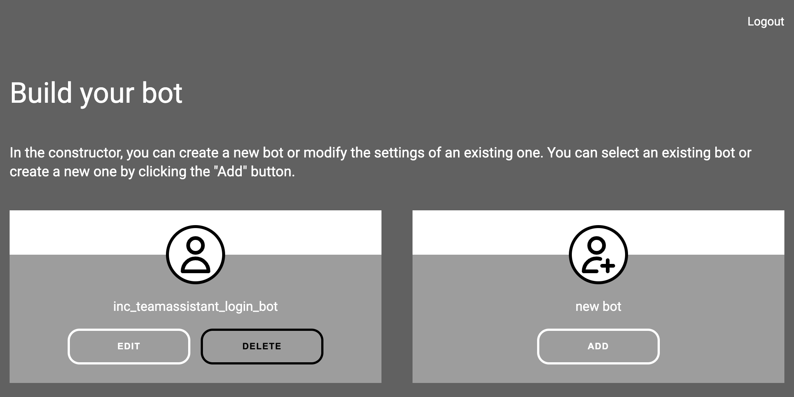
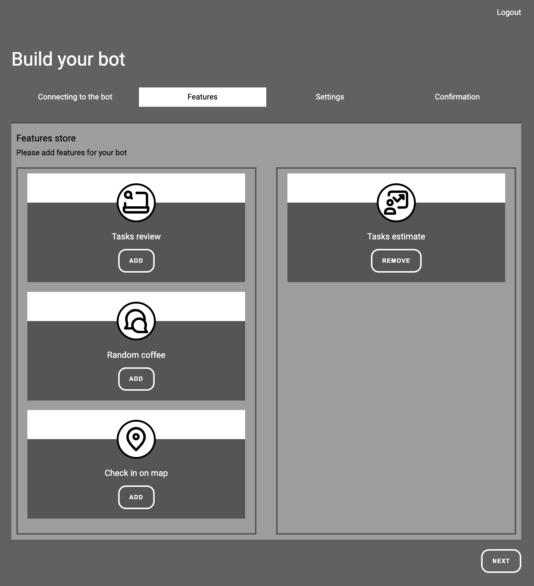

# Inc.TeamAssistant

A platform for creating telegram bots.
Allows you to create bots to manage processes in scrum teams.
Conduct an estimate of tasks 👌.
Organize code review process 🤝.
Manage distributed development teams 🌴.
Collect a random coffee meetings 💬.

## Table of contents

- [Features](#features)
- [Technology](#technology)
- [How to use](#how-to-use)
- [How to install](#how-to-install)
- [How to contribute](#how-to-contribute)
- [To do](#to-do)
- [Team members](#team-members)

## Features

- Create a bot for team
- Creating teams to work together
- Estimate of tasks. SP or t-shirts
- Select a reviewer for the code. Round-robin or random selection
- Notification of the review of the code and code owners
- Show teammates on world map
- Organize random coffee meetings

## Technology

- .net8
- Blazor
- FluentValidation
- Telegram.Bot
- Nuke
- FluentMigrator
- Dapper
- Npgsql
- Postgres

## How to use

Use my backend [constructor](https://team-assistant.online/constructor) for adding your bot
In the constructor, you can create a bot, add commands, and set up the bot's behavior.

1. Login with your telegram account

2. Add your bot

3. Select features for the bot

4. Enjoy the bot 😀

## How to install

Local deployment
1. Clone the repository `git clone https://github.com/dyatlov-a/Inc.TeamAssistant`
2. Go to the project folder `cd Inc.TeamAssistant/cicd`
3. Set password for postgres user in `docker-compose.yml`
4. Set ports in `docker-compose.yml`
5. Run `docker-compose up -d`
6. Move to url `http://localhost:{your_port}/constructor`
7. Login as super user
8. Create bot in telegram and get token
9. Add the bot to the system on the constructor page

## How to contribute

First off, thanks for taking the time to contribute!

All types of contributions are encouraged and valued. See the to do list for different ways to help.
Before starting work, please create an issue to discuss your idea.

The community looks forward to your contributions.

## To do

- [X] Create a bot for estimate tasks in SP
- [X] Create a bot to notify about code review
- [X] Create a bot to show teammates on the world [map](https://team-assistant.online/en/map/ced5ed88bb8b48e3956cce9a7c7f1fdb)
- [X] Add a feature to estimate tasks in t-shirts
- [X] Create a bot to help with organizing random coffee
- [X] Create a page to request a [demo](https://team-assistant.online/)
- [X] Update blazor app
- [X] Add a constructor for the Telegram bot
- [X] Add dashboard for the team (review stats, estimate stats...)
- [ ] Redesign UI/UX
- [ ] Integrate with GitLab (code review)
- [ ] Integrate with Jira (estimate tasks)
- [ ] Add a feature for use world map
- [ ] Split the monolith into separate services

## Team members

- Diatlov Aleksandr - Developer [GitHub](https://gist.github.com/dyatlov-a)